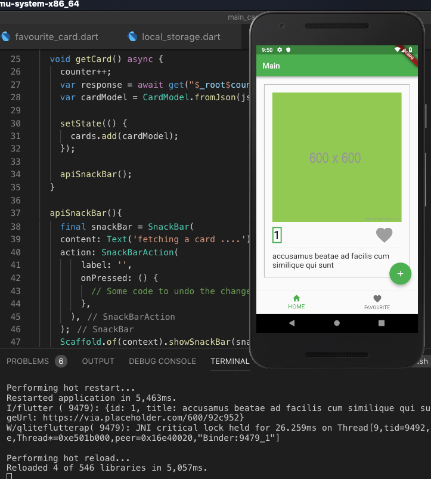

# api_sqlite_flutter_app

This is a Flutter project. The discussion of the application development can be found here: - [Slides](https://docs.google.com/presentation/d/1inQxoZDARDPLvnoBVAiTrVnlSX5VARvr_RY-kXiNvXo/edit?usp=sharing)

## Getting Started

This Flutter app demos simple use-case of REST API call and Local Storage consumption in Flutter.

## Installation
- [Install Flutter via this link](https://flutter.io/docs/get-started/install)
- Clone this project (ensure to start it too...winks).
- Navigate to the cloned project and run "Flutter run". Make sure you have chosen and started your emulator (if not running on physical device) before running the command. 

## Need help getting started with Flutter? Check below:
For help getting started with Flutter, view our 
[online documentation](https://flutter.io/docs), which offers tutorials, 
samples, guidance on mobile development, and a full API reference.
